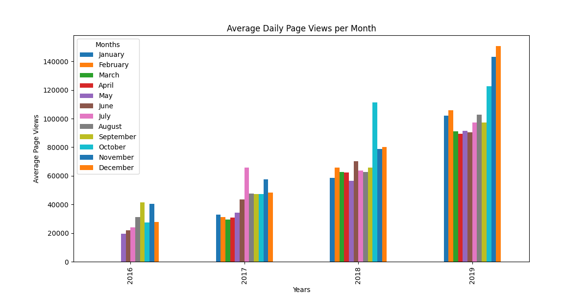
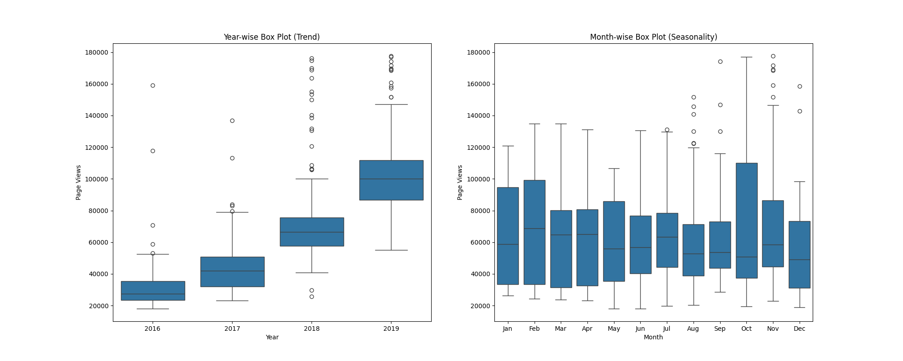
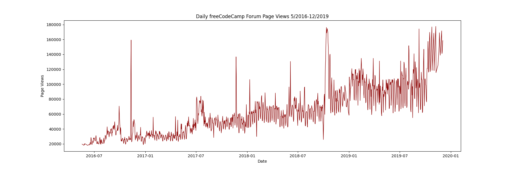

# Page Views Time Series Visualizer

## Overview
This project is a time series data visualizer for analyzing and visualizing page view trends. It processes data from a dataset of daily page views and generates insightful visualizations, including line plots, bar charts, and box plots. The goal is to understand long-term trends and distributions in web traffic. Instructions for building the project can be found [here](https://www.freecodecamp.org/learn/data-analysis-with-python/data-analysis-with-python-projects/page-view-time-series-visualizer).

## Features
- **Line Plot:** Displays overall trends in page views over time.
- **Bar Chart:** Shows the average daily page views for each month, grouped by year.
- **Box Plots:** Provides a distribution analysis of page views per year and month.
- **Data Cleaning:** Filters out outliers beyond the 2.5th and 97.5th percentiles.
- **Matplotlib & Seaborn Integration:** Utilizes these libraries for high-quality visualizations.

## Setup & Installation
### Prerequisites
Ensure you have Python installed (recommended version: 3.8+). You will also need the following dependencies:

```bash
pip install pandas matplotlib seaborn jupyter
```

### Clone the Repository
```bash
git clone https://github.com/ibringfaith/page-view-time-series-visualizer.git
cd page-view-time-series-visualizer
```

### Running the Project
1. Open a Jupyter Notebook:
   ```bash
   jupyter notebook
   ```
2. Open and run `time_series_visualizer.ipynb` to generate visualizations.
3. Alternatively, execute `main.py` to generate and save plots as images.

## Example Output
Here’s an example of the generated visualizations:




## Testing
To ensure that the visualizer functions correctly, run the unit tests:
```bash
pytest test_module.py
```
This will validate the implementation against expected output values.
